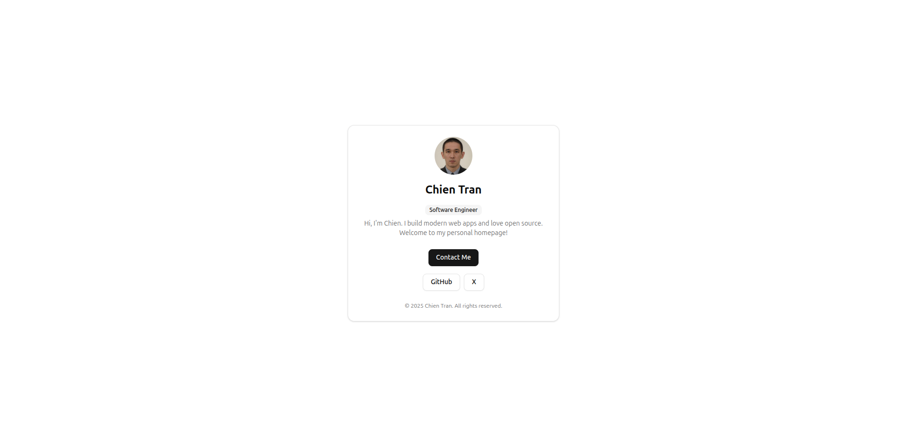

<p align="center">
   
</p>

# chientrm.com – Personal Homepage & Web App

**A modern, minimal, and instantly runnable personal homepage and web app.**

---

## 🚀 Quick Start (End Users)

Run this web app instantly, no build or setup required:

### 1. Run instantly with npx

```bash
npx @microh-labs/home
```

### 2. Or install globally (optional)

```bash
npm install -g @microh-labs/home
ulabs_home
```

### 3. Or install locally in a project

```bash
npm install @microh-labs/home
npx ulabs_home
```

#### Custom port

To run on a specific port:

```bash
PORT=5000 npx @microh-labs/home
# or
PORT=5000 ulabs_home
```

The app will print the URL to access it in your browser.

---

## 🌟 Features

- Modern, minimal design using [shadcn/ui](https://ui.shadcn.com/) React components
- Responsive and accessible
- Express API backend with Swagger docs

---

## 🛠️ For Developers

### Tech Stack

- React + TypeScript
- Vite
- Tailwind CSS
- shadcn/ui
- Express (API)

### Development (use pnpm)

Install dependencies:

```bash
pnpm install
```

Start the development server:

```bash
pnpm dev
```

**Important for Drizzle ORM migrations:**

> After changing your database schema, you must run:
>
> ```bash
> pnpm build
> node .
> ```
>
> at least once to apply migrations and hydrate the database. This step cannot be done from `pnpm dev` due to Vite's limitations with Node.js dynamic imports.

Build for production:

```bash
pnpm build
```

---

## For Maintainers: Publishing

This app is published to npm on every version tag push (e.g., `1.2.3`).

To release a new version:

1. Bump the version in `package.json` (or just tag with the new version).
2. Create a git tag matching the new version:
   ```bash
   git tag 1.2.3
   git push --tags
   ```
3. GitHub Actions will build and publish to npm automatically.

> **Note:** Lockfiles (pnpm-lock.yaml, etc.) are not published to npm.

---

© 2025 Chien Tran. All rights reserved.
